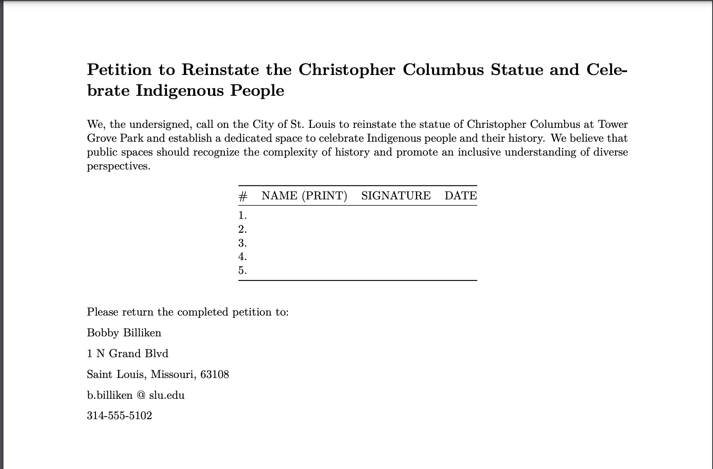

# Petition to Reinstate the Christopher Columbus Statue and Celebrate Indigenous People

This repository contains the files for a petition website calling for the reinstatement of the Christopher Columbus statue and the celebration of Indigenous people in a dedicated space. The petition aims to foster an inclusive understanding of diverse perspectives and acknowledge the complexity of history.

## Repository Contents

- `index.html`: The main HTML file for the website. It uses the [Bootstrap](https://getbootstrap.com/) CSS framework for styling and the [marked.js](https://marked.js.org/) library to render Markdown content as HTML.
- `petition.md`: The petition text in Markdown format. This file can be downloaded, printed, signed, and returned by supporters.
- `README.md`: This file, containing information about the repository and its contents.

## How to Use

1. Visit the live petition website at [https://stuartwastaken.github.io/petition-website/](https://stuartwastaken.github.io/petition-website/).
2. Read the petition text.
3. If you agree with the petition, download the `petition.md` file, print it, sign it, and return it to the address provided in the petition.

## Contributing

If you'd like to contribute to this project, please [create a fork](https://docs.github.com/en/get-started/quickstart/fork-a-repo) of this repository, make your changes, and submit a [pull request](https://docs.github.com/en/github/collaborating-with-pull-requests/proposing-changes-to-your-work-with-pull-requests/creating-a-pull-request).

## License

This project is licensed under the [MIT License](LICENSE).
